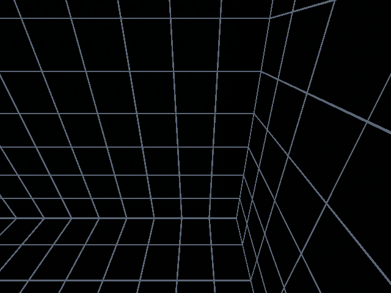
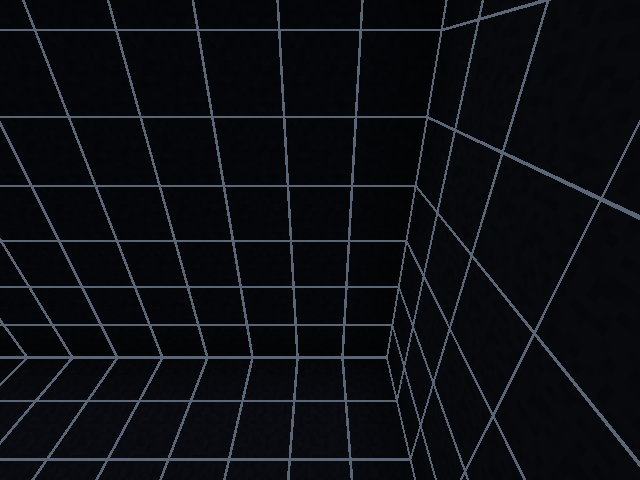

# R63 actual Tank display and measured generation scheduling

The same exact saved epoch9 baseline was used for two private native runs at TECH HUB producer `1363ff5d3158e07b27f4cfb393ecd85082d4397a`. Both used the same fixed NoAI/NoGravity Pig, offline spectator pose, initial options, recipe geometry, dependencies and read-only diagnostic JAR. Only saved/registered display mode differed: `NATIVE` or `OBSERVATION_BRIGHT`. Each fresh owner retained its original120s lease, with zero raw-capture actions and one private `AFTER_LEVEL` framebuffer. This is a derived display diagnostic, not raw Cardinal evidence or loaded-target completeness.

| NATIVE | OBSERVATION_BRIGHT |
|---|---|
|  |  |

The actual camera was `(84.5,229.61999988555908,7.5)`, yaw－90/pitch30; both frames are640×480. In the fixed wall region `[64,64,384,300)` selected before bright-image inspection, median Rec.709-weighted8-bit sRGB values increased from0.7874 to6.004;92.64% of pixels changed by more than3. These describe one pair of pixels, not physical luminance or causal GPU cost. Grid pixels are included; no pixel→material/UUID segmentation is asserted. Black concrete stays black, with wall texture becoming distinguishable. No runtime camera/world/light-state mutation was performed by the diagnostic. Synchronous GPU readback/PNG I/O and its extra runtime-only classpath perturb timing; these runs are excluded from observer-effect cost comparisons. Server ticks/world time/flicker were not exactly aligned.

Both runs reread1,089 actual saved cells and96,181 prior-region block identifiers with zero unavailable cells. Evidence finalized with14/16 unique canonical records, cleanACK/drop0/queue0/owned-process exit. The saved owner bytes were unchanged during each runtime. Official85/control85/common baseline87 and both preserved predecessors, pinned MOD8,444 outputs,149 compile dependencies and mapped TF hashes were reverified. Broader view/depth/label/entity-brightness and reset/dynamic acceptance remain open.

A separate source-identical, bounded JFR maintenance diagnostic generated1,089cells in another disjoint region `(104,224,0)`, saved epoch9→10 and closed the owner. Its fixed synthetic subject and spectator were placed outside both Tank regions offline; no product entity-removal or safety-gate exception was introduced. The first prepared inside-Tank fixture was retained as `NOT_LAUNCHED`. The actual new cells and97,270 cells of all seven prior regions were verified against the exact epoch9 baseline.58 unique canonical records finalized cleanly with drop0/queue0/owned exit. The recording was bounded to64MiB,180s retained age and240s maximum duration; actual retained JFR size17,865,801bytes.

The profile retained128 rotation-tagged server-thread execution/native sampling events, with zero truncated sampled stacks:110 include `guard`/`requireAuthority`,85 include the scoped-owner gate and97 include Windows filesystem frames. Sample leaves include56 `GetFileAttributesEx0`,28 `FindFirstFile0` and11 `FindClose`. These are stack-presence counts, not CPU-time percentages or independent tests. File-read thresholding retained zero slow read events; that does not prove zero I/O. Actual log warnings2950ms/59ticks and11794ms/235ticks remain retained. The sampled event envelope30.706s is not an exact total rotation duration or observer-effect comparison.

The focused source adjustment adds a25ms elapsed work budget between completed cells, retaining the maximum256cells per tick, all existing per-cell/boundary authority/quiet/world/material/hash checks and the original finite120s lease. Cursor/phase/digest/reservation continue on the next consecutive server tick. A synchronous guard/delegate or boundary save can exceed25ms: this is scheduling, not preemption or a hard per-tick limit. Expiry still becomes `OUTCOME_UNKNOWN`; there is no cache of authorization or renewal.

The new10ms-delegate clock case failed on the previous implementation, then passed with the adjustment.7,741 controller assertions include normal20TPS multi-tick completion,40ms single-cell overshoot, authority loss and original expiry after yield; existing partial-write, quiet, reentrant and exactly-once rules remain. Genuine Forge compilation and304 compiled boundaries,58 sealed plan assertions and10 actual atomic-publication assertions pass locally. The source adjustment was frozen at `2d54f281828fa450564255436653d19ddf832d0e`; a fresh native pacing trial from the same87-file epoch9 baseline, exact out-of-Tank fixture/options/JFR settings generated the same disjoint region and saved epoch10. Actual1,089 new cells and97,270 prior cells matched the preceding diagnostic.127 unique canonical records finalized with cleanACK/drop0/queue0/owned exit; original/control/baseline/predecessors/MOD/dependencies/TF hashes remained intact. The original120s lease was not changed. This paced trial retained no `Can't keep up!` warning; absence in one run is not a maximum tick-duration guarantee. Source/pytest checks for the exact publication HEAD are tracked separately in Draft PR80. No full original goal or performance acceptance is claimed.

[Machine-readable scoped proof](TANK-DISPLAY-PACING-EVIDENCE-2026-10-05.json) retains native IDs and hashes without uploading raw world data or JFR. [R62 native ownership/lease proof](TANK-ROTATION-NATIVE-2026-10-05.md), [rotation contract](../lab/docs/KNEEKURA_REGISTERED_TANK_ROTATION.md), [official world](../DEBUG-WORLD-AUTHORITY-2026-10-04.md), and [remaining original criteria](REMAINING-EXECUTION-MATRIX-2026-10-04.md) remain authoritative. The original goal remains active; one fresh whole-diff independent review is reserved for its true end.

The two ordered JFR trials establish descriptive responsiveness only. Phase-file polling spans28.276s before and55.777s after pacing; these are observation times, not exact phase durations. Work is spread over more ordinary ticks. Whole-trial retained server-heartbeat intervals average10.982 versus19.383ticks/s; maximum retained heartbeat gaps17.086s versus3.050s and95th-percentile nearest-rank gaps12.612s versus1.005s. These are20-tick heartbeat intervals with startup/closure tails (tick deltas also include28/37), not maximum single-tick latency or all-tick completeness. The paced JFR retained209 rotation sampling events, with182 including guard/requireAuthority: checks were not removed. No total CPU reduction, reversed-order/repeated-trial equivalence, no-JFR observer-effect or general all-size performance acceptance is asserted.

Original requirement reconciliation explicitly permits optional stages and bounded `NOT_EXPOSED`/`NOT_CAPTURED`; unknown custom reasons do not automatically require another internal hook. The required outstanding research, adapters, combined diagnoses, measurements and final audit are listed in [R63 original requirement reconciliation](ORIGINAL-REQUIREMENT-RECONCILIATION-2026-10-05.md). The new native pacing and paired Tank frames satisfy their scoped slices; they do not finish the original goal.

Frozen pacing source2d54f28 has all three hosted checks SUCCESS: [source push37239193329](https://github.com/genkimorimori252525-oss/KNEEKURA-TECH-HUB/actions/runs/37239193329), [source PR37239196483](https://github.com/genkimorimori252525-oss/KNEEKURA-TECH-HUB/actions/runs/37239196483), [pytest37239196347](https://github.com/genkimorimori252525-oss/KNEEKURA-TECH-HUB/actions/runs/37239196347). Actual PR merge checkout e13a40260c31cf2c0517c3ccdf2fe6602d644287 parents57e52f9ef44c082daf7abbb0b0f5ada3a258a406/2d54f281828fa450564255436653d19ddf832d0e were verified. Allnine mandatory source gates,205Motion/Decision cases,7741controller/58plan/304genuine markers and3156pass/332skip/8warnings are retained. Documentation publication HEAD CI/readback remains a separate final check.
